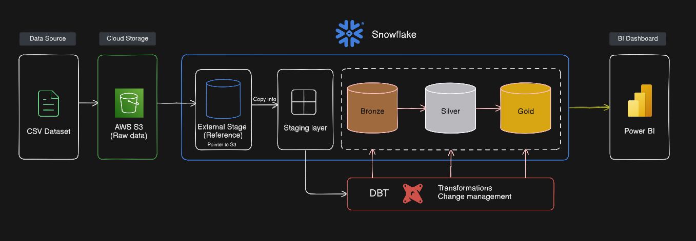

# 📊 Snowflake + dbt Data Pipeline (Olist E-commerce Dataset)

### 🚀 Overview

This project implements a modern data pipeline using Snowflake and dbt (Data Build Tool) on the Olist E-commerce dataset.
The goal is to transform raw data into a well-structured analytics layer and enable business insights through KPI-driven models and dashboards.

### 🏗️ Architecture

### 🧰 Tech Stack
- Data Warehouse: Snowflake
- Transformation Tool: dbt
- Visualization: Power BI
- Language: SQL
- Dataset: Kaggle Brazilian E-Commerce Public Dataset by Olist

### 📊 Data Layers Explained

- 🔹 Bronze Layer
  - Raw data ingestion from external stage
  - Minimal transformation
  - Maintains source fidelity
- 🔹 Silver Layer
  - Data cleaning and standardization
  - Handling nulls, duplicates, and data types
  - Business-ready intermediate tables
- 🔹 Gold Layer
  - Final analytics layer
  - Fact & dimension modeling
  - Aggregations for reporting and dashboards

### ⭐ Key Models

- 📌 Fact Tables
  - fact_orders → Order-level transactional data
  - fact_reviews → Customer review metrics
- 📌 Dimension Tables
  - dim_customers → Customer attributes
  - dim_products → Product details
- 📌 Aggregations (Marts)
  - agg_customer_metrics → Customer behavior insights
  - agg_product_performance → Product KPIs
  - agg_delivery_performance → Delivery efficiency
  - agg_daily_sales → Sales trends
  - agg_customer_rfm → RFM segmentation

### 📈 Key Business KPIs

- 💰 Total Revenue
- 📦 Total Orders
- 👥 Active Customers
- ⭐ Average Review Score
- 🚚 Delivery Time Performance
- 🔁 Repeat Customer Rate
- 🏆 Top Selling Products
- ⚠️ Low Rated Products
- 🧮 RFM Analysis

<!-- 📊 Power BI Dashboard

The Gold layer powers an interactive dashboard with:

KPI Cards (Revenue, Orders, Customers)
Sales Trends (Daily/Monthly)
Customer Segmentation (RFM)
Product Performance Analysis
Delivery Insights
🔥 Key Learnings
Building a medallion architecture (Bronze → Silver → Gold)
Designing fact & dimension models
Implementing incremental models in dbt
Creating analytics-ready datasets
End-to-end pipeline from raw data to dashboard
📌 Future Improvements
Add CI/CD for dbt
Implement dbt exposures for BI tools
Add data freshness checks
Integrate Airflow for orchestration
Enhance RFM with ML-based segmentation
🙌 Acknowledgements
Olist E-commerce Dataset
dbt Community
Snowflake Documentation -->

### 📬 Contact

If you found this useful, please star this repo and feel free to connect!